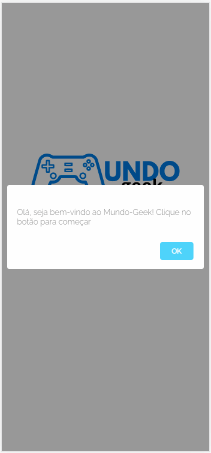
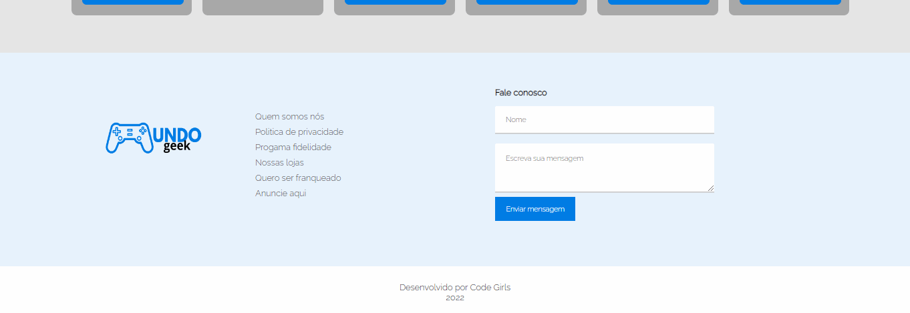
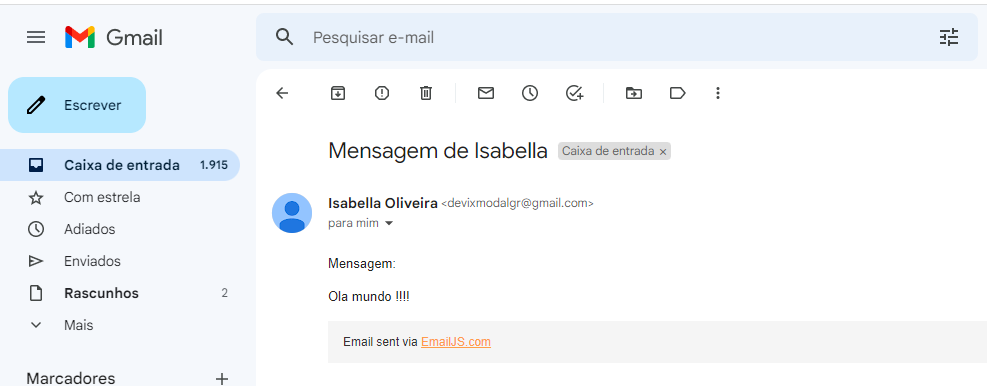
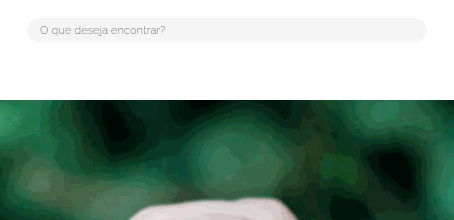
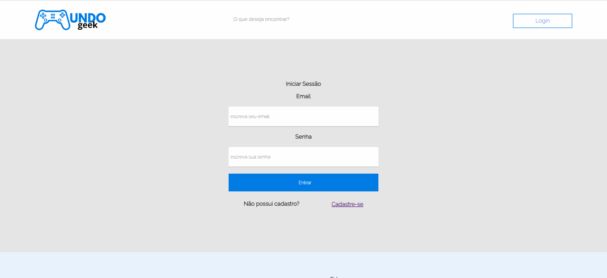
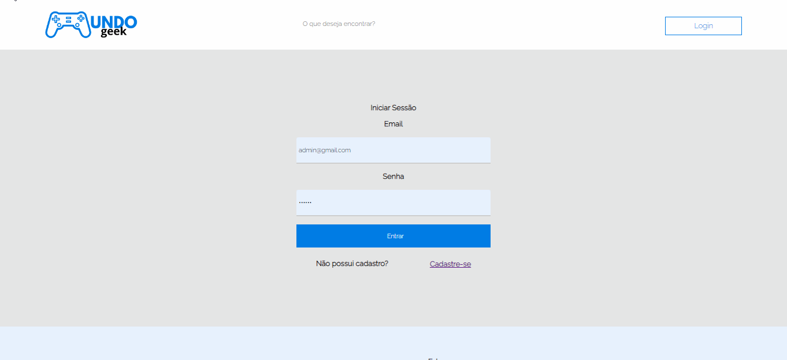
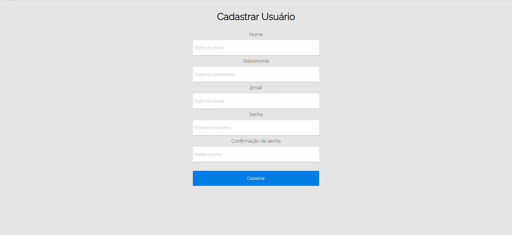
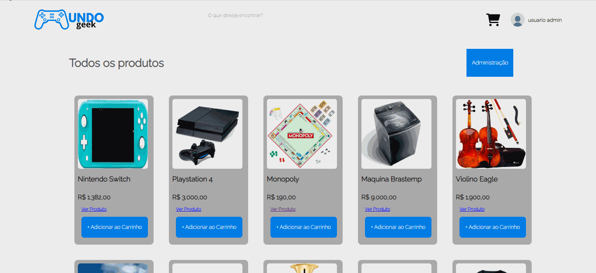
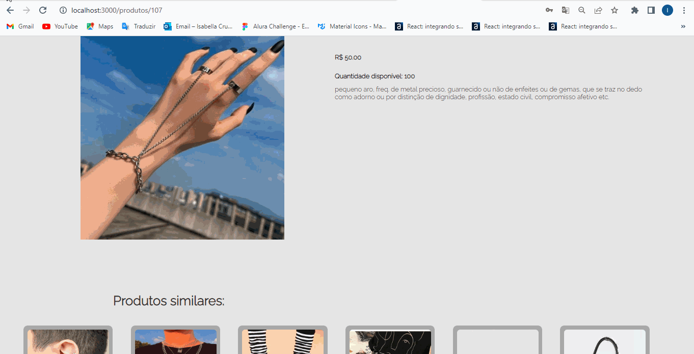
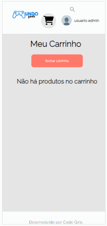

# Mundo Geek
O mundo geek é uma SPA onde o usuário pode se cadastrar, editar seus produtos e vizualizar os produtos existentes na página. Cada usuário possui um carrinho, onde ele pode adicionar os produtos para comprar. 

# PERFIS

USUÁRIO (é aquele que não possui login no site, essa pessoa tem acesso restrito a algumas telas, ou seja, não tem acesso a algumas delas e nem permissão para editar, remover, e adicionar produtos. Essa pessoa também não pode adiconar produtos ao carrinho, pois não terá acesso a ele sem logar). ADM (o adm é a pessoa que possui cadastro no site. Essa pessoa pode remover, editar e adicionar produtos tanto no carrinho quanto no site, essa pessoa terá acesso a mais telas e mais funcionalidades). 

## Tela Inicio "/"

Essa  tela somente fica com a responsabilidade de conter o botão de começar para que ao clicar, o usuário seja encaminhado para a página principal (home).

## Tela Home "/home"

Nessa tela,  o  usuário poderá buscar pelos produtos que deseja na barra de pesquisa, caso o usuário possua um login, ele pode faze-lo clicando no botão de login, ele será encaminhado para a página de login. Se o usuário estiver logado, o botão de login sumirá da sua tela e outros dois ícones aparecerão no lugar: o ícone de carrinho e o de perfil. O ícone de carrinho, é responsável por exbir os produtos que a pessoa adicionou no carrinho, e mostrar o preço, quantidade e valor total no carrinho.Também, cada produto adicionado terá um ícone de "x" para que ao clicar, o usuário possa remover determinado produto do carrinho. Já no ícone de perfil, o usuário será encaminhado para a tela de "meu perfil". Logo abaixo , temos o banner, que possui um botão com a frase "fale conosco" a partir desse botão, ao clicar, a tela do usuário é "rolada" para baixo, mais especificamente até a sessão "fale conosco" onde o usuário poderá enviar uma mensagem que será recebida no email dos desenvolvedores da página. Abaixo do banner, serão exibidos os produtos que a página contém, todos separados de acordo com a categoria que foram cadastrados. De forma que um produto,  pode ter até 2 categorias. Junto de cada conjunto de produtos, há um botão escrito "ver mais" onde ao clicar, o usuário é encaminhado para a página "/todososproutos". O usuário, também pode clicar no botão, "ver mais" que está em baixo de cada produto e ser encaminhado para a página que contém mais detalhes sobre aquele produto.  Também, cada produto irá possuir um botão de "+" que terá a responsabilidade de adicionar produtos ao carrinho. 

### usuário: 

### cliente ou administrador: 

### mobile: 

#### envio de mensagem

#### busca de produtos 

## Tela Login "/login"

ao clicar no botão de login na home, o usuário é encaminhado para a tela de login, onde é solicitado seu email e senha, o usuário então realiza o login, seus dados são enviados para a api, para conferir se esse usuário possui login, se sim, ele é encmainhado para a página home e os ícones do cabecalho mudam conforme explicado anteriormente. Caso ele não possua uma conta, o usuário será notificado disso, e ele permanecerá na mesma página , podendo clicar em  "cadastre-se" , caso ele clique, ele será encmainhado para a página de cadastro do usuário. 

## Tela Cadastro do Usuário "/cadastro/usuario"

Nessa tela, o usuário fornecerá seus dados para que os mesmos sejam enviados para a api e o seu cadastro seja realizado, os dados são: nome, email, senha e confirmação de senha. Ao cadastrar-se, em caso de sucesso, o usuário será notificado disso, e encaminhado para  a página home onde o mesmo procedimento explicado anteriormente acontecerá, e em caso de erro , ou seja, se por acaso o usuário já possuir uma conta, ele pode retornar para a página de login e logar , ou verficar qual foi o erro.
ps: caso o usuário já esteja logado, ele receberá a informação de que terá que sair de sua conta logada para depois conseguir entrar em outra. 

## Tela Meu Perfil "/perfil"

Nessa tela, o usuário pode vizualizar o seu nome (nome que usou para se logar), e abaixo, ele pode ver os produtos que ele cadastrou em sua conta. Ele pode editar e remover os produtos que adicionou, a partir de um botão de editar (encaminha ele para a pagina de editar produto)  e outro de remover. Também há um ícone onde ele pode sair de sua conta. 

### editar produto:

### deletar produto: 

## Tela de Detalhes do Produto "/produto/id"

Nessa tela, o usuário pode vizualizar a descrição de determinado produto que ela clicou, e abaixo pode ver os produtos  similares. 

## Tela de Todos os Produtos "/produtos"

Nessa tela, o usuário pode vizualizar todos os produtos que a api contém. Mas, se a pessoa for um adm, sua tela possuirá o botão "adicionar produto", que ao clicar, encaminha-o para a página de cadastrar produto. Caso contrário, a pessoa somente pode vizualizar todos os produtos sem que haja separação por categoria. 

## Tela Não Encontrada "/naoencontrada"

Essa página é exibida quando o usuário tenta acessar uma url inexistente, ela possui um botão de voltar, para que o usuário seja emncaminhado para uma página anterior.

## Tela Cadastro Produto/Categoria "/cadastro/"

Nessa tela,  terá a responsabilidade de cadastrar (de acordo com a categoria), o produto do adm. Nela, são solicitadas a url da imagem do produto, suas cattegorias (até 2), o nome, o preço e sua descrição. Ao clicar em adicionar produto, o mesmo deve aparecer na  tela home  de acordo com a categoria. E o usuário deve ser encaminhado para lá e notificado em caso de sucesso.  Aqui o adm vizualizará no cabeçalho, o botão de "menu administrador" que o encaminhará para a página "meu perfil" onde ele pode administrar seus produtos. 

## Carrinho "/carrinho"

Caso você seja um administrador ou um cliente, você pode adicionar produtos ao carrinho e efetuar sua compra. 

## mobile 

